# Offline replace wkhtmltopdf 0.12.6 → 0.12.6.1 (patched Qt)

[](LICENSE)
[](https://github.com/wkhtmltopdf/packaging/releases/tag/0.12.6.1-3)
[](https://www.gnu.org/software/bash/)
[](#)
[](#)
[](#)

[](https://github.com/shawkialaddin/offline-wkhtmltopdf-patched-qt/stargazers)
[](https://github.com/shawkialaddin/offline-wkhtmltopdf-patched-qt/commits/main)
[](https://github.com/shawkialaddin/offline-wkhtmltopdf-patched-qt)
[](https://github.com/shawkialaddin/offline-wkhtmltopdf-patched-qt/pulls)

Replaces an existing **wkhtmltopdf 0.12.6** (the distro package, built against an
*unpatched* Qt — "reduced functionality") with the official **wkhtmltox 0.12.6.1
patched-Qt** build on an **airgapped** server. No internet is touched on the target.

`0.12.6.1-3` is the release tag from the official
[`wkhtmltopdf/packaging`](https://github.com/wkhtmltopdf/packaging) repo. The
patched-Qt build is what gives you full headers/footers, page breaks, forms, etc.

## ⚡ Quick start

```bash
# 1) On an INTERNET-connected machine: stage the packages into a tarball
git clone https://github.com/shawkialaddin/offline-wkhtmltopdf-patched-qt.git
cd offline-wkhtmltopdf-patched-qt
./stage-download.sh                       # → wkhtmltox-offline-bundle.tar.gz

# 2) Copy the tarball to the AIRGAPPED server (scp / USB)
scp wkhtmltox-offline-bundle.tar.gz user@airgapped-host:/tmp/

# 3) On the AIRGAPPED server: extract and install (no internet used)
tar -xzf /tmp/wkhtmltox-offline-bundle.tar.gz
cd wkhtmltox-offline-bundle
sudo ./install-offline.sh                 # auto-detects distro, verifies, installs

# 4) Confirm
wkhtmltopdf --version                      # → 0.12.6.1 (with patched qt)
```

📖 Full runbook with every flag, fallbacks, and troubleshooting: **[STEPS.md](STEPS.md)**

## 🔄 How it works

```mermaid
flowchart LR
    subgraph ONLINE["🌐 Internet-connected box"]
        A["stage-download.sh"] --> B["Query GitHub release API<br/>(tag 0.12.6.1-3)"]
        B --> C["Download .deb / .rpm<br/>+ SHA256SUMS"]
        C --> D["📦 wkhtmltox-offline-bundle.tar.gz"]
    end

    D -->|"scp / USB"| E

    subgraph AIRGAP["🔒 Airgapped server (no internet)"]
        E["install-offline.sh"] --> F["Detect distro / arch"]
        F --> G["Pick + checksum package"]
        G --> H["Remove old 0.12.6"]
        H --> I["Install new package<br/>(dpkg / rpm)"]
        I --> J["✅ Verify: 0.12.6.1<br/>with patched qt"]
    end
```



## Two-step workflow

### 1. On an internet-connected machine — stage the packages

```bash
./stage-download.sh                 # download ALL distro/arch packages (safe)
# or narrow it down if you know the target:
./stage-download.sh -f bookworm -f amd64
```

Produces `wkhtmltox-offline-bundle.tar.gz` containing:

```
wkhtmltox-offline-bundle/
├── packages/            # the .deb / .rpm files + SHA256SUMS
├── install-offline.sh   # the installer (copied in automatically)
└── MANIFEST.txt
```

Filenames are discovered live from the GitHub release API, so they're always the
real assets — nothing is hard-coded/guessed.

| Flag | Meaning |
|------|---------|
| `-f <term>` | Keep only packages whose name contains `<term>` (repeatable, AND'd) |
| `-t <tag>`  | Use a different release tag (default `0.12.6.1-3`) |
| `-o <dir>`  | Output directory |
| `-B`        | Don't build the tarball, just stage the folder |

### 2. Copy to the airgapped server, then install

```bash
tar -xzf wkhtmltox-offline-bundle.tar.gz
cd wkhtmltox-offline-bundle
sudo ./install-offline.sh           # interactive
# or:
sudo ./install-offline.sh -y        # non-interactive
```

The installer:

1. Auto-detects distro family, version codename, and architecture.
2. Picks the matching package from `packages/` (with sensible fallbacks — e.g.
   Ubuntu Focal/amd64 → `jammy_amd64`, Debian Buster → `bullseye`).
3. Verifies the package SHA256 against `SHA256SUMS`.
4. Records the current `wkhtmltopdf --version`.
5. Removes the conflicting old distro `wkhtmltopdf` package (skip with `--keep-old`).
6. Installs the new package via `dpkg -i` / `rpm -Uvh` — **offline**.
7. Verifies the result reports `0.12.6.1 (with patched qt)` and offers a render smoke-test.
8. Logs everything to `/var/log/wkhtmltox-offline-install.<timestamp>.log`.

| Flag | Meaning |
|------|---------|
| `-y`            | Assume "yes" (non-interactive) |
| `-p <dir>`      | Package directory (default `./packages`) |
| `-P <file>`     | Force a specific package file |
| `--keep-old`    | Don't remove the old distro `wkhtmltopdf` |
| `--no-verify`   | Skip checksum verification |

## Important: dependencies on the airgapped box

The patched-Qt build **bundles its own Qt**, so it has only a handful of runtime
deps (fontconfig, freetype, libjpeg, libpng, libx11/xext/xrender, zlib). These are
present on almost every server. If `dpkg`/`rpm` reports a missing dependency, it
cannot be fetched offline — install it from your own offline repo/mirror first,
then re-run. The installer prints exactly which deps are missing.

## Verify manually any time

```bash
wkhtmltopdf --version
# expected:  wkhtmltopdf 0.12.6.1 (with patched qt)
which -a wkhtmltopdf      # patched build installs to /usr/local/bin
```
